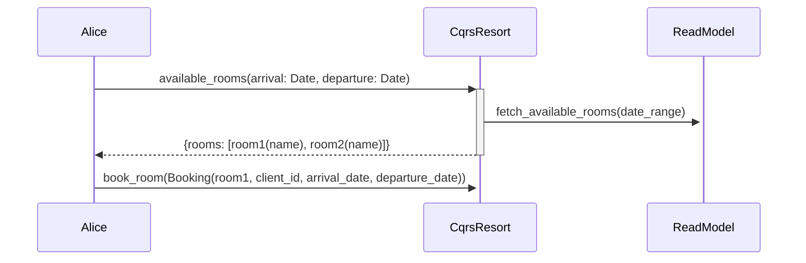

# CQRS Booking

You should implement a simple booking soluiton in CQRS architecture.

## About CQRS

[CQRS](https://learn.microsoft.com/en-us/azure/architecture/patterns/cqrs) for Command Query Responsibility Segregation Pattern.

A query returns data and does not alter the state of the object. A command changes the state of an object but does not return any data.

We will split our code in read and write code to really live this pattern

## Booking subject

We want to make a booking solution for one hotel.

The first 2 users stories are :

- As a user I want to see all available rooms.
- As a user I want to book a room.

They want to use the CQRS pattern, To do that we will have:

- one command service with a function `book_room(Booking)` they call the `WriteRegistry` they notify the `ReadRegistry` called by query service with function `Room[] available_rooms(arrival: Date, departure: Date)`

The Booking struct contains:

- client id
- room name
- arrival date
- departure date

And the Room struct contain only:

- room name

### Source

<https://codingdojo.org/kata/CQRS_Booking/>

inspiration source of this kata : <https://github.com/tpierrain/CQRS/>
explanation of CQRS by Microsoft <https://docs.microsoft.com/en-us/previous-versions/msp-n-p/jj591573(v=pandp.10>
